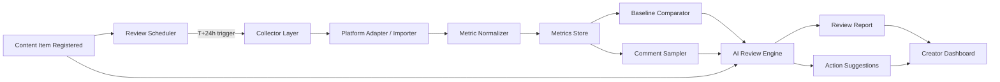
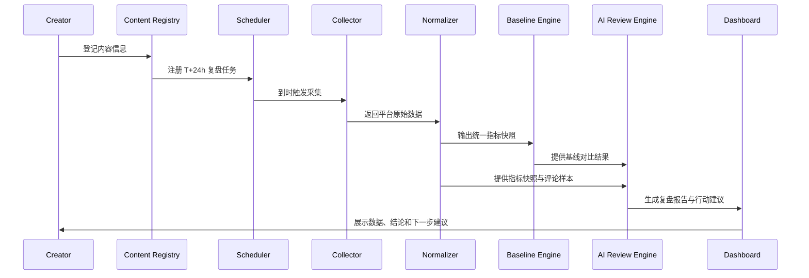

# 发文后 24 小时复盘系统：开源生态、MVP 定义与产品方案

> 版本：v1  
> 用途：内部立项文档  
> 定位：这不是一个新的发布器，而是一个以内容为中心的 T+24h 复盘与下一步决策引擎。

## 1. 执行摘要

当前开源生态已经分别覆盖了内容发布、平台数据采集、通用分析底座、Agent 自动化四个层级，但还缺少一个真正围绕“**内容发布后 24 小时发生了什么**”来组织产品体验的系统。

这意味着创作者虽然可以借助现有工具完成发布、拉数据、看图表、做部分自动化，却很难得到一个统一答案：

- 这篇内容现在到底表现得怎么样
- 它是输在分发、内容结构还是受众错配
- 下一步应该继续放大、跟进选题，还是停止追加

本方案的结论是：MVP 不应该先做重型多平台发布，也不应该一开始就追求团队协作，而应优先做一个**跨平台通用的复盘引擎**，围绕统一数据模型、T+24h 快照、基线对比、AI 诊断和行动建议建立闭环。

## 2. 机会判断

### 2.1 现有开源生态的四层结构

目前相关项目大致分为四层：

1. **内容发布层**  
   解决“怎么发”和“怎么排期”，代表项目如 `postiz-app`、`mixpost`、`Socioboard-5.0`。
2. **创作者分析样例层**  
   解决“怎么看基础数据”，常见形态是单平台 dashboard demo。
3. **数据采集层**  
   解决“怎么把平台数据抓回来”，代表项目如 `MediaCrawler`、`redbook`。
4. **分析底座层**  
   解决“怎么存储、建模、查询和展示事件数据”，代表项目如 `PostHog`、`Openpanel`、`Plausible`、`Metabase`。

### 2.2 市场缺口

缺口不在“没有工具”，而在“没有以复盘任务为中心的产品组织方式”。

现有项目多数有以下问题：

- **按平台组织，而不是按内容组织**  
  创作者关心的是“这篇内容”，不是先切到某个平台后台再找指标。
- **按原始指标组织，而不是按决策组织**  
  绝大多数面板能展示阅读、点赞、评论，但不能回答“下一步该干什么”。
- **能看数据，但缺少统一口径**  
  不同平台字段不一致，导致创作者很难横向比较。
- **自动化有了，但复盘闭环没成型**  
  一些 Agent 工具能发、能抓、能回复，但没有把“内容登记 -> T+24h 诊断 -> 建议输出”连成稳定系统。

### 2.3 机会定义

因此，这个项目的机会不是成为下一代社媒排程工具，而是成为一个覆盖以下流程的复盘产品：

```text
内容登记 -> 24 小时快照 -> 指标归一化 -> 基线比较 -> AI 诊断 -> 下一步建议
```

核心价值不是“看更多图表”，而是“**把原始反馈翻译成创作者可执行的决策**”。

## 3. 开源生态重组

以下项目不再平铺为“20 个同类产品”，而是按在方案中的角色进行重组。

### 3.1 产品壳子 / 工作流参考

这类项目更适合参考产品壳子、账号管理、排程发布和工作流组织方式。

| 项目 | 角色判断 | 可借鉴点 |
| --- | --- | --- |
| `gitroomhq/postiz-app` | 社媒管理产品壳子 | 多平台发布、工作台组织、AI 辅助入口 |
| `inovector/mixpost` | 轻量发布与管理平台 | 账号接入、内容排程、统一后台结构 |
| `socioboard/Socioboard-5.0` | 老牌社媒管理平台 | 平台聚合、报表模块、邮件报告思路 |
| `BetaStreetOmnis/xhs_ai_publisher` | 中文平台自动化发布器 | 小红书内容生产与自动发布流程 |
| `Xiangyu-CAS/xiaohongshu-ops-skill` | Agent 运营工作流 | 选题、创作、分析、复盘串联思路 |

结论：这类项目适合借鉴“产品外壳”和“运营动作编排”，但不适合直接拿来当复盘引擎。

### 3.2 分析样例参考

这类项目更像“分析页面 demo”或“单平台分析样例”，适合参考界面、指标选择和可视化方式。

| 项目 | 角色判断 | 可借鉴点 |
| --- | --- | --- |
| `NafisRayan/Social-Media-Dashboard` | 通用前端 dashboard demo | 仪表盘布局、卡片信息层级 |
| `hemantDwivedi/social-media-analytics` | 社媒分析样例 | 基础统计图表与实体关系 |
| `yogeshwarghule/social-media-performance-analysis` | AI 分析 demo | 将互动数据接到 AI 生成洞察 |
| `abernathyregina/Threads-Analytics-Dashboard` | 单平台分析样例 | 标签、互动与内容表现追踪 |

结论：这类项目适合作为“怎么展示复盘结果”的参考，但不足以支撑完整的产品闭环。

### 3.3 数据采集参考

这类项目负责把平台侧原始数据拉回系统，是复盘能力的前置基础。

| 项目 | 角色判断 | 可借鉴点 |
| --- | --- | --- |
| `NanmiCoder/MediaCrawler` | 多平台抓取底座 | 国内平台笔记、评论、帖子抓取 |
| `lucasygu/redbook` | 小红书 CLI 工具 | 搜索、分析、抓取和自动化入口 |

结论：采集层解决“有没有数据”，但不解决“如何统一解释这些数据”。

### 3.4 趋势 / 信号补充

这类项目不直接做复盘，但适合作为“下一篇写什么”的外部信号源。

| 项目 | 角色判断 | 可借鉴点 |
| --- | --- | --- |
| `sansan0/TrendRadar` | 热点与舆情监控 | 多平台热点聚合、关键词筛选、趋势信号补充 |

### 3.5 分析底座补充

这类项目解决事件采集、指标计算、BI 报表和看板能力，适合作为底层基础设施或参考对象。

| 项目 | 角色判断 | 可借鉴点 |
| --- | --- | --- |
| `PostHog/posthog` | 产品分析平台 | 事件模型、对比分析、行为查询 |
| `Openpanel-dev/openpanel` | 轻量产品分析平台 | 统一事件口径、直观分析体验 |
| `plausible/analytics` | 轻量网站分析 | 简洁指标体系、低复杂度展示 |
| `umami-software/umami` | 简洁分析平台 | 面向运营者的易读型面板 |
| `metabase/metabase` | BI 工具 | 快速构建报表、查询和仪表盘 |
| `apache/superset` | 高扩展 BI | 复杂数据探索与组织级看板 |

结论：分析底座能提供强大的基础能力，但它们默认不是“创作者复盘产品”，仍然需要内容模型和 AI 逻辑层。

## 4. 竞品结论

### 4.1 哪些像同类产品

真正与本项目最接近的是：

- `postiz-app`
- `mixpost`
- `Socioboard-5.0`
- `xhs_ai_publisher`
- `xiaohongshu-ops-skill`

这些项目接近的原因，不是它们已经完成了 T+24h 复盘，而是它们更接近“创作者工作流产品”，已经拥有以下中的一部分：

- 内容生产或排程入口
- 多平台或单平台的内容管理界面
- 自动化运营工作流
- 数据回看或运营支持能力

### 4.2 哪些不是同类产品，但值得纳入方案

以下项目容易被误归类为“同类产品”，但它们更准确的角色应是能力部件：

- `MediaCrawler`、`redbook`：采集层
- `TrendRadar`：趋势信号层
- `PostHog`、`Openpanel`、`Plausible`、`Umami`、`Metabase`、`Superset`：分析底座层
- `Social-Media-Dashboard`、`Threads-Analytics-Dashboard`：展示样例层

### 4.3 产品判断

最终判断如下：

- 开源生态已经覆盖“发布、采集、分析底座、自动化”四段
- 真正缺的是“**以内容为中心的 T+24h 复盘产品**”
- MVP 应优先做“统一复盘视图 + AI 诊断 + 下一步行动建议”
- 不应先做重型多平台发布和团队协作，否则会在工程上过早扩张

## 5. MVP 定义

### 5.1 产品对象

MVP 的基本对象统一抽象为 `content item`，不区分文章、帖子、短内容、长内容，只在元数据层区分内容类型。

这样做有两个目的：

- 先把“复盘逻辑”做通，而不是被平台特性绑死
- 保持数据模型足够稳定，后续再为不同平台补专有字段

### 5.2 必须做

#### 1. 内容登记

系统需要允许创作者登记一篇内容的基础信息：

- `platform`
- `account_id`
- `content_type`
- `publish_at`
- `url`
- `title`
- `topic_tags[]`

这一步可以来自手工录入、导入或未来的平台回写，但对 MVP 来说，重点是建立可复盘的主键对象。

#### 2. 24 小时数据快照

系统需要在 `publish_at + 24h` 触发主复盘任务，并采集该时点的指标快照，包括但不限于：

- 曝光或展示
- 阅读或播放
- 点赞
- 评论
- 转发
- 收藏
- 关注转化
- 点击

评论不需要全量进入 AI，只需要抽样即可。

#### 3. 统一指标归一化

不同平台字段必须映射到统一口径：

- `impressions`
- `reads`
- `likes`
- `comments`
- `shares`
- `saves`
- `follows`
- `clicks`

规则：

- 字段允许缺失
- 不强制所有平台都有完整指标
- 原始平台返回值保留在 `raw_payload`

#### 4. 基线对比

MVP 不能只显示绝对值，必须做相对判断。

推荐优先级：

1. 同平台最近 10 条内容基线
2. 若样本不足，退化为该账号近 30 天平均

输出结果至少要能告诉用户：

- 高于基线
- 接近基线
- 低于基线
- 基线可信度不足

#### 5. AI 复盘报告

每篇内容在 T+24h 需要生成一份结构化复盘，包括：

- 表现总结
- 原因诊断
- 亮点
- 风险
- 置信度

AI 的角色是“解释数据并形成可执行判断”，不是生成长篇空话。

#### 6. 行动建议面板

建议类型固定为 5 类：

- `放大传播`
- `跟进选题`
- `改写重发`
- `评论区运营`
- `停止追加`

MVP 只输出建议，不代执行。

#### 7. 单人创作者仪表盘

首页围绕“内容”而不是“平台”组织，单条内容详情页需要同时展示：

- 原始数据
- 基线对比
- AI 总结
- 下一步建议

### 5.3 延后做

以下能力放到后续版本：

- `72h` 和 `7d` 复盘
- 评论主题聚类增强
- 更精细的转化归因
- 下一步建议的模板库个性化
- 内容表现的跨平台聚合比较

### 5.4 明确不做

v1 明确不做：

- 多成员协作与角色权限
- MCN 多账号矩阵视图
- 自动改稿并重发
- 自动回复评论
- 全平台官方 API 深度集成
- 复杂营销漏斗与多触点归因

## 6. 系统方案

### 6.1 核心对象

#### ContentItem

| 字段 | 含义 |
| --- | --- |
| `id` | 内容主键 |
| `platform` | 所属平台 |
| `account_id` | 内容归属账号 |
| `content_type` | 文章、帖子、短内容等 |
| `title` | 标题或主题概述 |
| `topic_tags[]` | 主题标签 |
| `url` | 内容链接 |
| `publish_at` | 发布时间 |

#### MetricSnapshot

| 字段 | 含义 |
| --- | --- |
| `content_id` | 对应内容 |
| `captured_at` | 快照时间 |
| `impressions` | 曝光 |
| `reads` | 阅读/播放 |
| `likes` | 点赞 |
| `comments` | 评论 |
| `shares` | 转发 |
| `saves` | 收藏 |
| `follows` | 关注转化 |
| `clicks` | 点击 |
| `avg_read_time?` | 平均阅读时长，可选 |
| `raw_payload` | 原始平台返回 |

#### ReviewReport

| 字段 | 含义 |
| --- | --- |
| `content_id` | 对应内容 |
| `review_at` | 复盘时间 |
| `overall_score` | 综合评分 |
| `confidence` | 结果可信度 |
| `summary` | 摘要结论 |
| `diagnosis[]` | 原因诊断 |
| `strengths[]` | 表现亮点 |
| `risks[]` | 风险项 |

#### ActionSuggestion

| 字段 | 含义 |
| --- | --- |
| `report_id` | 对应复盘报告 |
| `type` | 建议类型 |
| `priority` | 优先级 |
| `rationale` | 建议原因 |
| `expected_impact` | 预期影响 |
| `suggested_deadline` | 建议执行时间 |

### 6.2 接口抽象

系统的三段核心接口如下：

```text
collect(content_id) -> raw platform payload
normalize(raw payload) -> MetricSnapshot
review(ContentItem + MetricSnapshot + baseline + comment sample) -> ReviewReport + ActionSuggestion[]
```

这三段接口的意义是把系统切为四层：

- 内容对象层
- 采集与适配层
- 指标与基线层
- AI 复盘层

这样后续接入新平台时，只需要扩展采集与归一化，不必重写整个复盘逻辑。

### 6.3 产品结构图



### 6.4 数据流



### 6.5 AI 建议逻辑

AI 逻辑必须固定为“规则层先行，模型层解释”的方式，避免直接让模型自由发挥。

#### Step 1. 表现判断

先基于规则做分类，至少识别以下状态：

- 高曝光低互动
- 低曝光高互动
- 高评论争议
- 表现平稳
- 明显优于基线

#### Step 2. 原因归因

再结合以下信息生成 2-3 条原因假设：

- 标题主题
- 评论主题
- 互动结构
- 与基线相比的异常点

输出格式应是“假设”，而不是伪装成确定事实。

#### Step 3. 行动映射

从固定策略库中选择 1-3 条建议，而不是开放式生成。

| 触发条件 | 建议类型 | 典型动作 |
| --- | --- | --- |
| 曝光高、互动低 | `改写重发` | 优化标题、封面、开头钩子 |
| 互动高、评论集中某主题 | `跟进选题` | 追加一篇深挖内容 |
| 收藏/分享高 | `放大传播` | 做二次分发或改编为短版 |
| 评论负面集中 | `评论区运营` | 补解释、答疑、修正文案 |
| 全面弱于基线 | `停止追加` | 不再追加分发，转向新选题 |

#### Step 4. 置信度约束

样本不足时必须降级：

- 历史样本少于阈值，降低基线可信度
- 评论为空时，不做评论主题归因
- 平台字段缺失时，不输出过强结论

系统允许“信息不足”，不允许“强行下判断”。

### 6.6 Dashboard 信息架构

MVP 页面建议包含三个核心视图：

#### 1. 内容列表页

展示：

- 内容标题
- 平台
- 发布时间
- 当前复盘状态
- 综合评分
- 建议类型标签

#### 2. 内容详情页

展示：

- 原始指标卡
- 与基线的对比
- 评论样本摘要
- AI 复盘报告
- 行动建议

#### 3. 待处理建议页

展示：

- 所有未处理建议
- 按类型分组
- 按优先级排序

这个页面是把“分析结果”转成“运营动作”的关键桥梁。

## 7. 落地建议

### 7.1 推荐推进顺序

建议按四段式推进：

1. **统一数据模型**
2. **导入 / 采集适配层**
3. **AI 复盘引擎**
4. **Dashboard**

原因是：

- 没有统一对象，后续任何平台接入都会返工
- 没有采集层，AI 没有输入
- 没有规则与建议映射，Dashboard 只能变成普通报表页
- Dashboard 应该消费已有结构化结果，而不是承担分析职责

### 7.2 推荐 MVP 技术策略

MVP 推荐采用以下实现策略：

- 平台接入先走“导入 + 轻采集”，不要一开始做全平台重度 API 集成
- 指标系统先只覆盖少数高价值字段
- AI 先做“分析 + 建议”，不做自动执行
- 详情页围绕单条内容复盘设计，而不是围绕平台运营后台设计

### 7.3 验收标准

MVP 至少需要满足以下场景：

- 一篇内容在发布后 24 小时自动生成一份复盘报告
- 不同平台字段不一致时，系统仍能输出统一口径的结果
- 新账号样本少时，报告会降低置信度而不是装作确定
- 评论为空时，系统仍能基于数值指标给出建议
- 建议必须可执行，不能只有抽象评价
- 页面同时展示原始数据、基线对比、AI 总结和下一步建议
- 全链路默认人工确认，不自动代执行任何运营动作

### 7.4 最终判断

这项工作的正确起点不是“再造一个社媒管理平台”，而是从创作者最真实的任务出发：

> 我发出去的这篇内容，24 小时后到底值不值得继续投入？

如果系统能持续稳定地回答这个问题，并把结论翻译成可执行建议，它就已经具备了清晰的产品价值。
